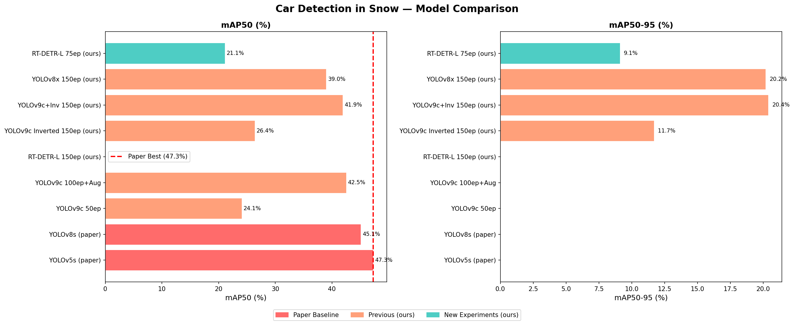

# Car Detection in Snow — YOLOv9 & Beyond

## Project Description

Vehicle detection in snowy conditions using multiple deep learning architectures fine-tuned on the Nordic Vehicle Dataset (NVD). UAV footage from northern Sweden. This project extends the original YOLOv9 baseline with new experiments including inversion augmentation, larger models, transformer-based detection, and fully inverted datasets.

---

## Dataset

[Nordic Vehicle Dataset (NVD)](https://nvd.ltu-ai.dev/)

**Split:**
- Train: 3,034 frames (Asjo 01, Asjo 01_HD, Bjenberg 02)
- Val: 236 frames (Nyland 01)
- Test: 2,027 frames (Bjenberg 02_stabilized)

---

## Experiments

### 1. YOLOv9c + Inversion Augmentation
Fine-tuned YOLOv9c with snow-specific augmentations including image inversion (white snow → black background), CLAHE contrast enhancement, and mosaic augmentation. Trained for 150 epochs.

### 2. YOLOv8x (Extra Large)
Larger YOLOv8 architecture with 68M parameters for improved feature extraction. Trained for 150 epochs with AdamW optimizer.

### 3. RT-DETR (Real-Time Detection Transformer)
Transformer-based detector without NMS. Better handling of overlapping objects. Trained for 75 epochs.

### 4. YOLOv9c on Fully Inverted Dataset
All training images inverted (white snow becomes black background, dark vehicles become white). Tests whether full inversion preprocessing improves detection compared to augmentation-only approach.

---

## Results

### Validation Set (Nyland 01)

| Model | Precision (%) | Recall (%) | mAP50 (%) | mAP50-95 (%) |
|-------|--------------|-----------|-----------|--------------|
| YOLOv5s (paper) | 54.2 | 33.7 | 47.3 | — |
| YOLOv8s (paper) | 65.8 | 22.4 | 45.1 | — |
| YOLOv9c 50ep (ours) | 55.5 | 25.0 | 24.1 | — |
| YOLOv9c 100ep+Aug (ours) | 58.2 | 42.5 | 42.5 | — |
| **YOLOv9c+Inv 150ep (ours)** | **54.4** | **41.8** | **41.9** | **20.4** |
| YOLOv8x 150ep (ours) | 58.5 | 37.6 | 39.0 | 20.2 |
| RT-DETR-L 75ep (ours) | 44.7 | 26.0 | 21.1 | 9.1 |
| YOLOv9c Inverted 150ep (ours) | 42.8 | 31.4 | 26.4 | 11.7 |

### Key Findings

- **YOLOv9c + Inversion Augmentation** achieves the best mAP50 (41.9%) among our models
- **Inversion as augmentation** outperforms full dataset inversion (41.9% vs 26.4% mAP50)
- **RT-DETR** underperforms on this dataset — transformer models require more data/epochs
- **mAP50-95** reported for the first time: best model achieves 20.4%
- Test set (Bjenberg 02) presents significantly harder conditions than validation set

---

## Model Comparison Chart



---

## Sample Detections


*Best model (YOLOv9c+Inv) detecting vehicles in snowy UAV footage*

---

## Trained Weights

Download best.pt from Google Drive: [best.pt](best.pt)

---

## How to Run

```bash
pip install ultralytics
yolo predict model=best.pt source=YOUR_IMAGE conf=0.01
```

---

## Requirements

- Python 3.10
- PyTorch 2.11.0 + CUDA
- ultralytics 8.4.47
- albumentations
- opencv-python

---

## Citation

```bibtex
@misc{nvd2023,
  title={Nordic Vehicle Dataset (NVD): Performance of vehicle detectors using newly captured NVD from UAV in different snowy weather conditions},
  author={Mokayed, H. and Nayebiastaneh, A. and others},
  year={2023},
  eprint={2304.14466}
}
```
